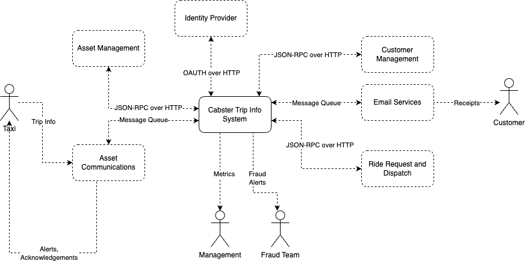

System Scope and Context
========================

External interfaces consumed by the application:

1. Asset Management
   1. Asset information retrieval
2. Asset Communication System
   1. Asset message ingest
   2. Asset message sending
3. Ride Request and Dispatch
   1. Trip start/stop sending
   2. Billing information sending
4. Customer Management
   1. Customer information retrieval
   2. Customer fraud flagging request sending
5. Email services
   1. Email sending
6. Identity Provider
   1. Confirming Tokens

scope_context.drawio.png

Business Context
----------------

**Communication Partners**

| Partner    | Data To                  | Data From        | Data Format |
| ---------- | ------------------------ | ---------------- | ----------- |
| Car        | Acknowledgements, Alerts | Trip Information | MQTT        |
| Customer   | Receipt                  | -                | Email       |
| Management | Aggregated Trip Data     | -                | JSON        |
| Fraud Team | Fraud Alerts             | -                | Email       |

Technical Context
-----------------

| External System            | Interface         |
| -------------------------- | ----------------- |
| Asset Management           | JSON-RPC HTTP API |
| Ride Request and Dispatch  | JSON-RPC HTTP API |
| Customer Management        | JSON-RPC HTTP API |
| Asset Communication System | Message Queue     |
| Email Services             | Message Queue     |
| Identity Provider          | OAUTH over HTTP   |