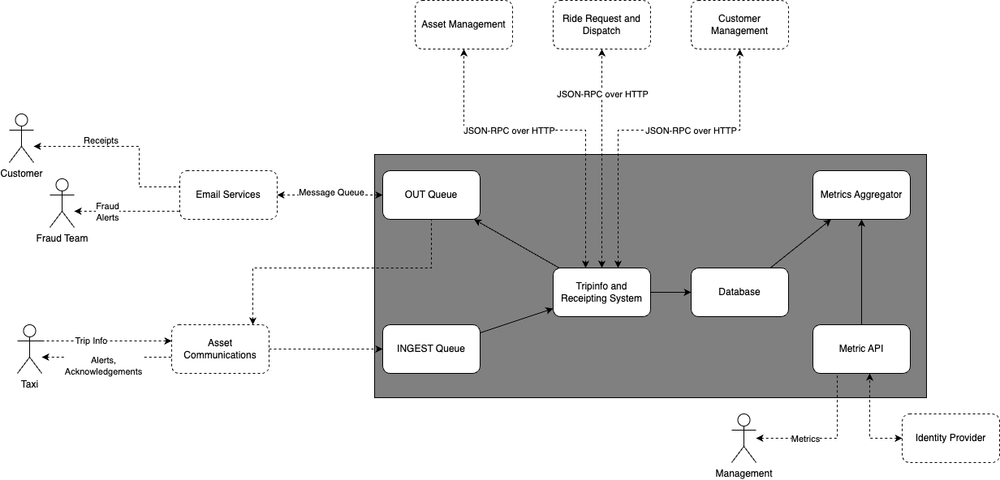
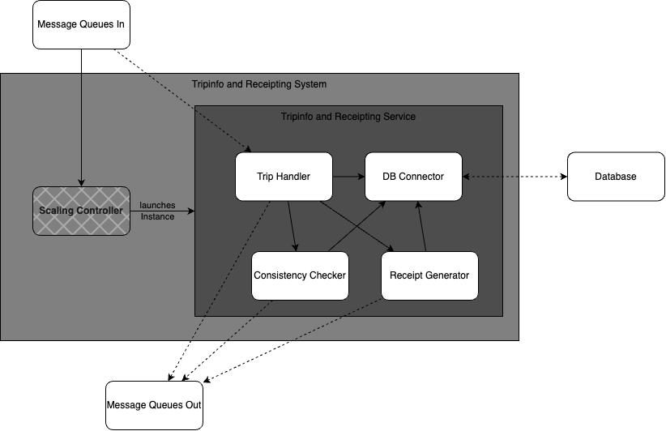

Building Block View
===================

Whitebox Overall System
-----------------------

The System is split into: 
1. *Messaging Queues*: These enable async communication with the assets and the Email Services. In this case, Queues were chosen because of their high throughput, and the cost of this throughput (asynchronicity) is not an issue in this case
2. *Tripinfo and Receipting System*: This handles the transactional part of the incoming messages. Trips are started, stopped, receipts generated and alerts raised. This system also stores this data persistently in the database. Uses the OUT-Queue to communicate acknowledgements and Alerts to the assets, the Ride Request and Dispatch System to get asset and ride information and the Customer Management System for customer information.
3. *Metrics Aggregator*: This is responsible for aggregating data which is persisted in the DB by the Tripinfo system. The metrics aggregator receives queries or has queries stored for aggregating mass data into datapoints
4. *Metrics API*: This enables controlled access to the Metrics Aggregator by ways of using an Identity Provider.
5. *Database*: Used for storing mass data and aggregating this data into metrics

Level 2
-------

### White Box Tripinfo and Receipting System

The Tripinfo and Receipting System contains the folliowing main building blocks:
1. A Scaling controller that is controlled by incoming messages from the IN-Queue. This launches an instance of the tripinfo system only if there are messages waiting, and scales down again after the queue is empty
2. The Trip Handler which handles all incoming and outgoing messages and distributes them to the relevant subsystem. This also writes start and stop trip data to the DB using the DB Connector
3. The Consistency Checker which checks if trips raise the fraud alarm
4. The Receipt Generator which builds a receipt based on trip data
5. The DB Connector which pools DB Connections and handles query sanitation
   